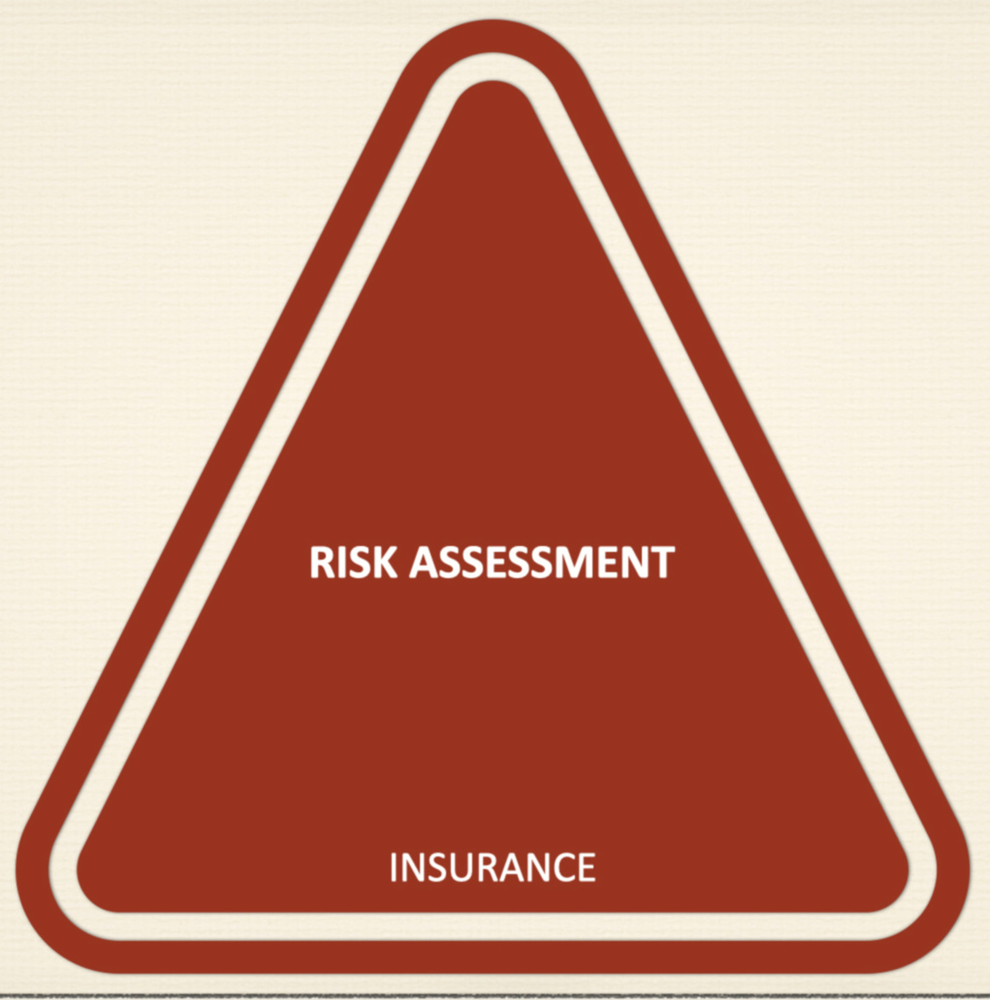

# Insurance Risk Assessment

### Brief on Risk Assessment
- Risk Assessment is also called as underwriting. This is a method that insurers use for evaluating and assessing the risk associated with the Insurance policies.It also helps in deciding the premium for an Insurance Policy.
- Some of the risk associated with the insurance is mortality rate, morbidity rate etc.

### ML for Risk Assessment in Insurance
- With the help of historical data on various parameters like demography, medical history, employment, work history etc of the applicant, the risk level bands could be predicted with various ML classification algorithms.

### Objective/Problem Statement
- Predict Risk levels given different attributes of the applicant and policy.

### Available Data
- Product Info
- Insurer's demography
- Insurer's Employment History
- Insurer's Medical History
- Insurer's Family History
- Insurer's Insurance History
- Insurance Policy Information
- Target Variable: Risk Band (8 risk bands are provided)

### Data Analysis
- Imbalanced Target Variable
- Features are masked data
- Some features have more than 50% values as NULL

### Algorithms used
- Random Forest
- Logistic Regression

### Validation methods
- Accuracy
- Confusion Matrix
- Classification Report

More details and python code on all the above ones could be found in the Jupyter Notebook.
