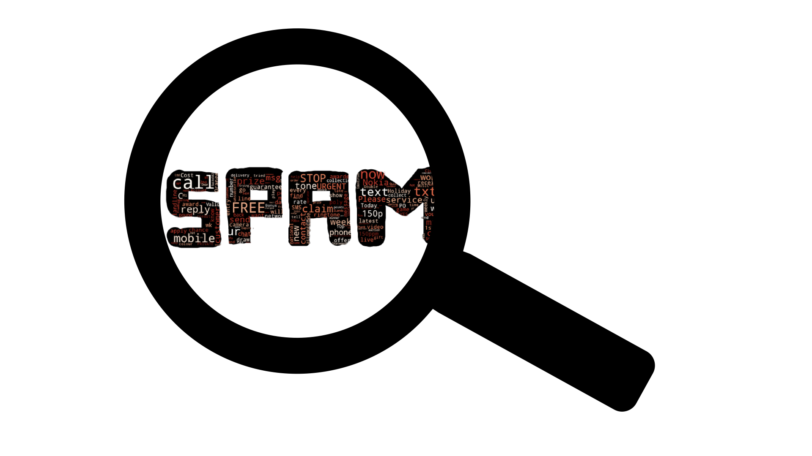

# Spam Detection
With the increase in digital communication, all of us receive lot of communications through sms, emails and other digital mode. 
This has certainly made the life much easier since it is fulfilling a number of communication needs. At the same time, when this medium is used outside its purpose it can turn out to be dangerous for recipient's information security. In this scenario, the need to identify a text message to be a spam or not spam becomes very important. 

### Objective/Problem Statement
Predict the spam vs non spam based on the given text messages

### Data Available
- Text messages
- Labels: Spam or not Spam

### EDA
- Classes Spam vs Non Spam are imbalanced. 
- wordcloud_Spam
- wordcloud_NotSpam

### Model used
- Naive Bayes
- Random Forest

### Validation Techniques
- Confusion matrix
- Classification Report
- Accuracy

    ** All the analysis is done based on the data available. Kindly reach out to me on any questions @email:s.goswami2323@gmail.com
